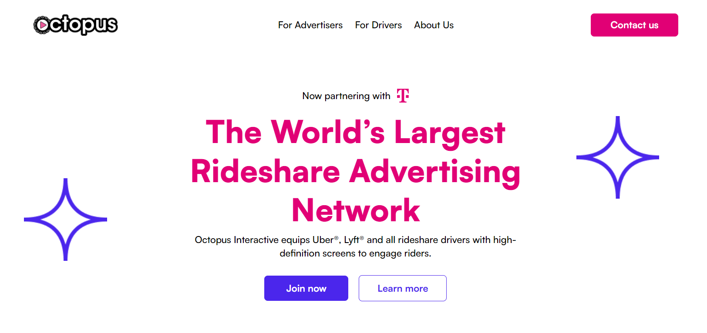

# 🐙 Octopus - Digital Marketing Agency

This repository contains the project files for Octopus, a modern digital marketing agency website built using Webflow. The site showcases services such as SEO optimization, website design, and digital advertising. It features a sleek, responsive design, ensuring an optimal experience across all devices.

## 🎯 Key Features
- **Modern Design**: Elegant and user-friendly interface.
- **Responsive Layout**: Fully optimized for mobile, tablet, and desktop.
- **Comprehensive Services**: From SEO to digital advertising.

## 🔗 Live Demo
Check out the live website [here](https://octopus-f83592.webflow.io/).

## 🖼️ Screenshot

## 🛠️ Technologies Used
- **Webflow**: For design and development.

## 📧 Contact
For any inquiries or collaboration opportunities, feel free to reach out via email: [your-email@example.com](mailto:ilicwebservices@gmail.com)
